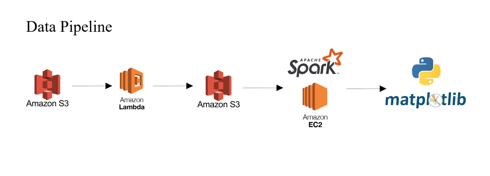

# Table of Contents 
1. [Introduction](README.md#introduction)
2. [Pipeline](README.md#pipeline)
3. [How it works](README.md#How%20it%20works)
4. [Environment Set Up](README.md#Environment%20Setup)


# Introduction
**Youtube Trending - create a data pipeline to process youtube trending data**

This project is completed in 2 weeks , as a opportunity to learn building a data pipeline using Amazon cloud service, and using spark-nlp librabry to do data cleasing and create a meaningful wordcloud

In this project, I use data source from https://www.kaggle.com/rsrishav/youtube-trending-video-dataset . The data source provide dataset of data on daily trending YouTube videos, in different region from  IN, US, GB, DE, CA, FR, RU, BR, MX, KR, and JP.
I have built a data pipeline that will transform the dataset into readable diagram and word cloud for analysis.
Below are some example of graph generated (data of ~ July 2021 - Jan 2022)

**GB word cloud**


**US word cloud**


**GB most trending category (base on number of trending video)**


**US most trending category (base on number of trending video)**


# Pipeline
I built a pipeline that use aws lambda to preprocess the input csv , store it in s3, and later process the data with spark and python for plotting and analysis.



1. File upload to S3 bucket (in this case , hytsaibucket/Raw/)
2. Lambda function triggered, which start to clean and extract the useful data and put it in csv format.
3. The processed csv file is put in S3 bucket (hytsaibucket/Processed) , and the raw data is deleted
4. The csv is transferred to AWS EC2 and spark session , processed.
5. Plotting and tracking price trends by Matplotlib.

# How it works

1)  S3:  Set up a S3 bucket.  In this case:  s3://hytsaibucket/ , and two folder for storing input and output (Raw/ and Processed/)
2)  AWS Lamda: set up a lambda function with the script in lambda folder, set the timeout limit to 5 mins and memory to at least 1024mb.
3)  Set up a EC2 instance , use Anaconda to set up a environment to run PySpark, other dependent library can be found in bottom of this page.
After downloading PySpark, set up environment variable.
export SPARK_HOME="Path of your Spark folder"
export PYTHONPATH=$SPARK_HOME/python/lib/py4j-0.10.7-src.zip:$PYTHONPATH  
export PYTHONPATH=$SPARK_HOME/python:$SPARK_HOME/python/build:$PYTHONPATH

If you are running it locally , you will also need to set up HADOOP_HOME and download wintils.exe , for more detail, read this https://sparkbyexamples.com/spark/spark-hadoop-exception-in-thread-main-java-lang-unsatisfiedlinkerror-org-apache-hadoop-io-nativeio-nativeiowindows-access0ljava-lang-stringiz/
6)  After setting up your EC2 instance with all dependcies, create a new folder , put data/ , python/ and output/ folder in it.
7)  Use aws cli to transfer processed file from S3 and related category_id.json, then execute bar_chart_generation.py , then word_cloud_generation in python folder.

**Languages** 
* Python 3.9

**Technologies**
* Spark
* AWS Lambda
* AWS S3
* AWS EC2

**Third-Party Libraries**
* AWS CLI
* Matplotlib
* Findspark
* Seaborn
* Spark nlp
* AWS Data Wrangler
* Pandas

# Environment Setup

For Lambda function, it is important to use a layer so to allow we use aws data wrangler and Pandas to process the file stored in S3 bucket.
You can download it in their Github release page, pack it and uplaod it as a layer .https://github.com/awslabs/aws-data-wrangler/releases

Install and configure base on  [AWS](https://aws.amazon.com/cli/).

Check if you have Java 8/Java 11 installed (required by spark-nlp)
If using conda:
```
conda create -n youtube python=3.9 -y
conda activate youtube
pip install spark-nlp==3.4.0 pyspark==3.1.2 matplotlib findspark seaborn
```

else:
```
pip install spark-nlp==3.4.0 pyspark==3.1.2 matplotlib findspark seaborn
```


remember to set path variable when running spark locally
export SPARK_HOME="Path of your Spark folder"
export PYTHONPATH=$SPARK_HOME/python/lib/py4j-0.10.7-src.zip:$PYTHONPATH  
export PYTHONPATH=$SPARK_HOME/python:$SPARK_HOME/python/build:$PYTHONPATH


You will also need to set up HADOOP_HOME and download wintils.exe , for more detail, read this https://sparkbyexamples.com/spark/spark-hadoop-exception-in-thread-main-java-lang-unsatisfiedlinkerror-org-apache-hadoop-io-nativeio-nativeiowindows-access0ljava-lang-stringiz/


